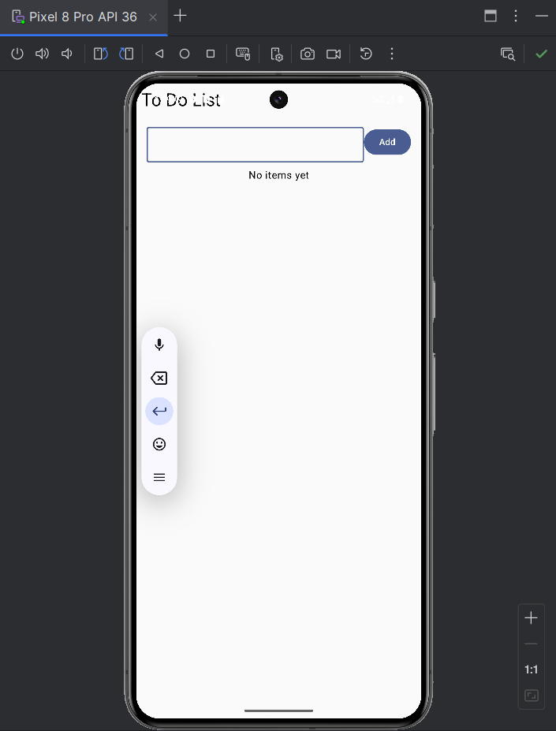
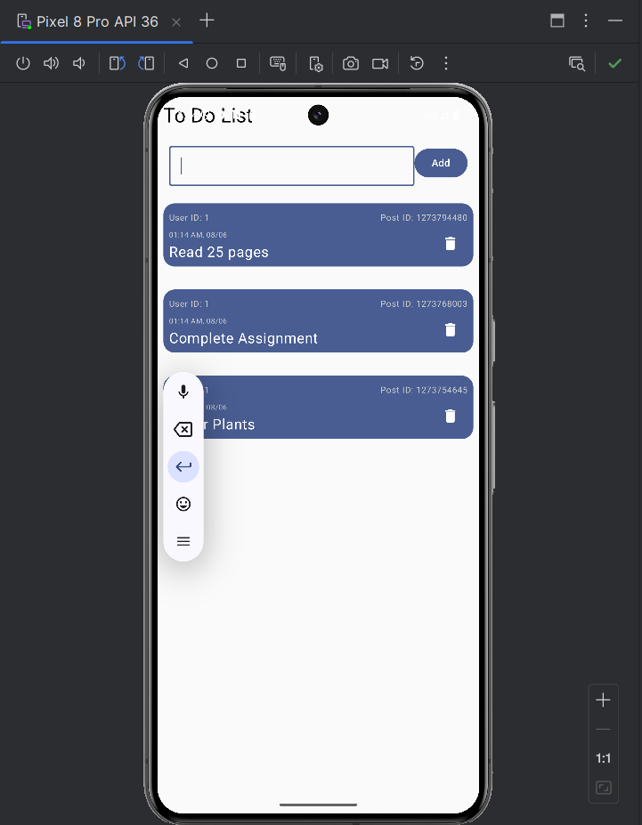
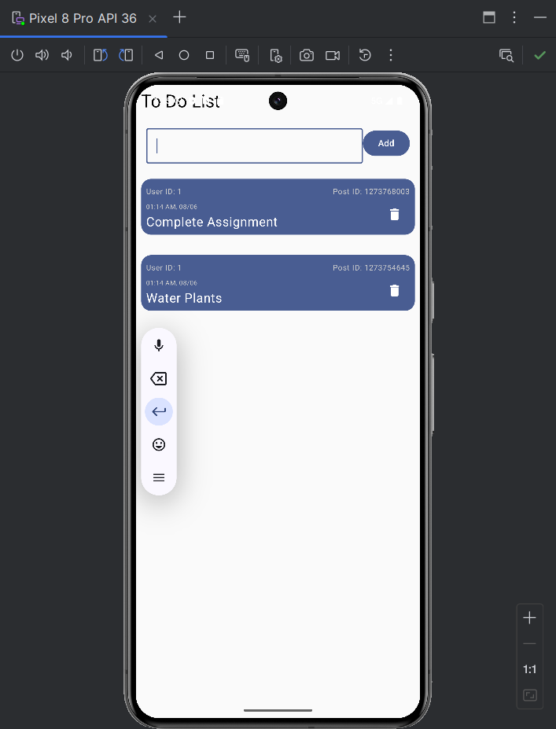

# ToDoApp-in-Kotlin
ToDoApp-in-Kotlin is a simple and clean To-Do list app built using Kotlin and Jetpack Compose. It lets users add, complete, and delete tasks with a responsive UI powered by ViewModel and state management.

✨ Features
✅ Add, complete, and delete tasks with ease showing real-time date after adding the task.

🧩 UI enhancements using Compose Modifier options

📌 Custom layout with User ID on the left and Post ID on the right

🎨 Encourages UI customization and layout experimentation

❌ Delete individual ToDo items with a dedicated button

## 📱 Screenshots

  

## 🎥 Demo

<video src="https://github.com/user-attachments/assets/59166901-196e-49a9-8525-9dae7b637320" controls width="600"></video>
